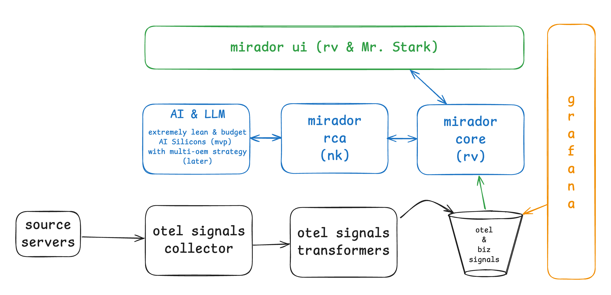
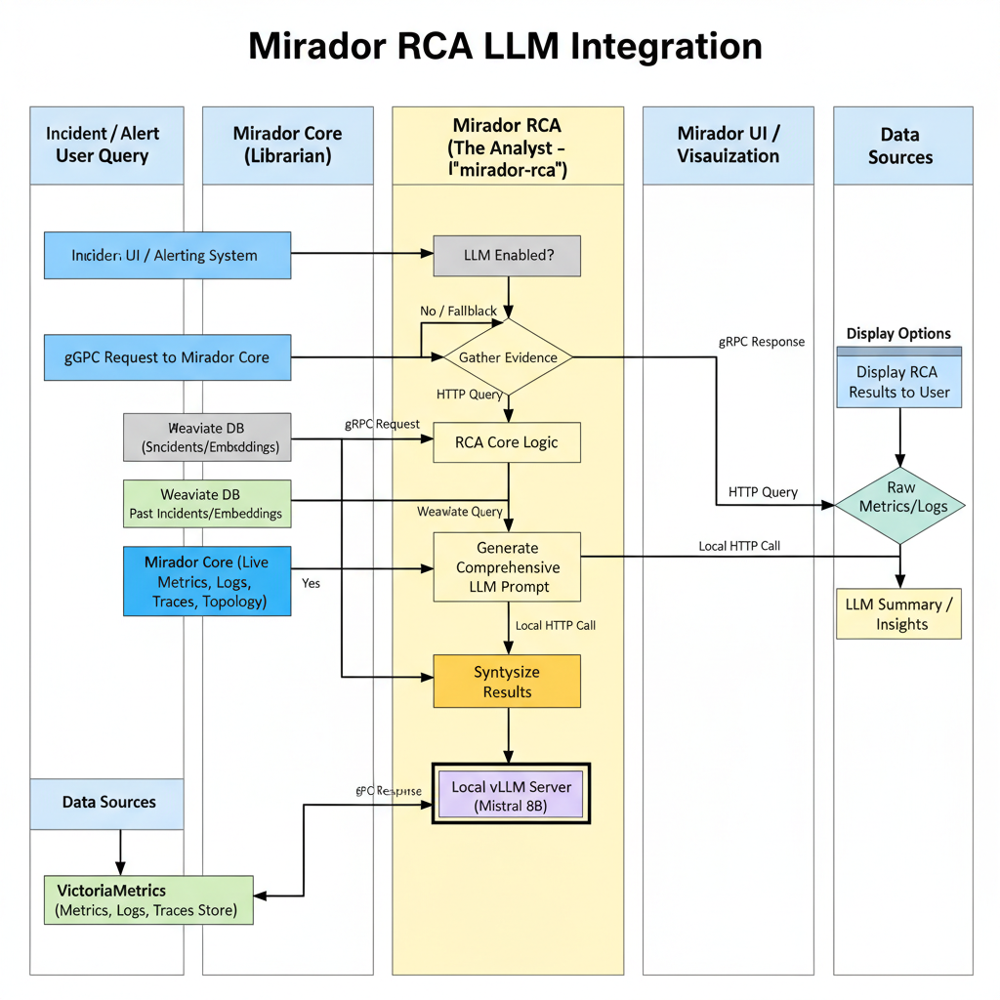

# mirador-rca

> Work-in-progress Root Cause Analysis service for the Mirador stack.

## Prerequisites
- Go 1.23+
- `protoc` with Go & gRPC plugins (`protoc-gen-go`, `protoc-gen-go-grpc`).
- External Weaviate cluster reachable from the service.
- mirador-core API access for metrics/logs/traces aggregation.
- **Mandatory:** Deploy the OpenTelemetry Collector [servicegraphconnector](https://github.com/open-telemetry/opentelemetry-collector-contrib/tree/main/connector/servicegraphconnector) and ensure its emitted service graph metrics are available. mirador-rca relies on this topology data to correlate anomalies across services; if the endpoint is missing or empty, investigations fail.
- Configure mirador-core to expose a service-graph endpoint (default `/api/v1/rca/service-graph`) that proxies the connector metrics so mirador-rca can fetch the dependency topology prior to each investigation.
- mirador-rca performs no synthetic fallbacks—metrics, logs, traces, and service graph data **must** be returned by mirador-core for investigations to succeed.
- See `docs/phase3-eval.md` for precision@1 evaluation details and `docs/indicent-analysis.md` for a deep dive of the pipeline.

## Quickstart
```
make fmt            # gofmt + goimports all sources
make verify         # fmt-check + lint + vet + test
make govulncheck    # vulnerability scan (requires govulncheck)
make build          # produces bin/mirador-rca
make image          # docker build tagged with git describe
make image-offline  # docker build with network access disabled
```

`make ci` runs the full verification plus `govulncheck` locally.

## Local Development Stack

Launch the Docker Compose sandbox (mock mirador-core, Valkey, Weaviate, and the service) with:

```
make localdev-up
```

Shut everything down and remove data volumes with `make localdev-down`. The stack definition lives under `deployment/localdev` and mounts your working copy so code changes are picked up instantly.

Run the service locally:
```
go run ./cmd/rca-engine --config configs/config.yaml
```

Build & publish a container image:
```
make docker-build IMAGE=ghcr.io/your-org/mirador-rca:$(git rev-parse --short HEAD)
make docker-push  IMAGE=ghcr.io/your-org/mirador-rca:$(git rev-parse --short HEAD)
```

Configuration fields are documented in `configs/config.example.yaml`.

## Valkey caching

Phase 4 adds read-through caching for Weaviate nearest-neighbour lookups and mirador-core service graph fetches. Configure the cache block in your config file (or via the `MIRADOR_RCA_CACHE_*` env vars) to point at a Valkey/Redis endpoint. Example:

```yaml
cache:
  addr: "valkey.mirador.svc.cluster.local:6379"
  username: ""
  db: 0
  tls: false
  similarIncidentsTTL: 2m
  serviceGraphTTL: 5m
```

If `addr` is blank the cache is disabled and requests fall back to direct Weaviate / mirador-core calls.

## LLM Integration with LMCache

mirador-rca supports optional LLM-powered analysis enhancement using vLLM with LMCache integration for heavy caching in airgapped environments with inference cards.

### Local Development

The localdev environment includes a vLLM service with LMCache enabled:

```bash
cd deployment/localdev
docker compose up --build
```

This starts vLLM with:
- Small model (`facebook/opt-125m`) for testing
- LMCache enabled with 2GB cache size
- Local CPU backend for development

### Production Deployment

Enable vLLM with LMCache in the Helm chart:

```bash
helm install mirador-rca charts/mirador-rca \
  --set vllm.enabled=true \
  --set vllm.model="microsoft/DialoGPT-medium" \
  --set vllm.resources.requests.nvidia\\.com/gpu=1
```

### Configuration

```yaml
vllm:
  enabled: true
  model: "microsoft/DialoGPT-medium"  # Override for production
  lmcache:
    enabled: true
    maxCacheSize: "10GB"  # Increase for production
    storageBackend: "LocalCPUBackend"  # Use GPU backend for inference cards
```

### Benefits

- **Heavy Caching**: LMCache provides efficient KV cache management for LLM inference
- **Airgapped Ready**: Optimized for environments without internet access
- **Inference Card Optimized**: Designed for GPU/accelerator-based inference
- **Fallback Support**: RCA works with or without LLM enhancement

For a full guide, see `docs/llm-integration.md`.

## API

mirador-rca exposes both gRPC and REST APIs for root cause analysis operations.

### gRPC API

The primary API is gRPC, defined in `internal/grpc/proto/rca.proto`. The service runs on the port configured via `server.address` (defaults to `:50051`).

### REST API

A REST API equivalent is available on the port configured via `server.restAddress` (defaults to `:8080`). The REST API is fully compliant with OpenAPI 3.0.3 specifications.

**OpenAPI Specifications:**
- [YAML format](api/openapi.yaml)
- [JSON format](api/openapi.json)

**Endpoints:**
- `POST /api/v1/investigate` - Initiate root cause analysis
- `GET /api/v1/correlations` - List historical correlations
- `GET /api/v1/patterns` - Retrieve failure patterns
- `POST /api/v1/feedback` - Submit user feedback
- `GET /health` - Health check

## Metrics & Alerts

mirador-rca exposes Prometheus metrics on the HTTP endpoint configured via `server.metricsAddress` (defaults to `:2112`). The binary registers both the gRPC default metrics (`grpc_server_handled_total`, handling histograms) and custom RCA series:

- `mirador_rca_investigations_total{outcome="success|error"}`
- `mirador_rca_investigation_seconds`

Disable the endpoint by setting `server.metricsAddress: ""` (or `.Values.metrics.enabled=false` in the Helm chart). Refer to `docs/ops-observability.md` for the SLO catalogue, alert rules, and Grafana dashboard guidance.

## Helm deployment

A production-ready Helm chart lives under `charts/mirador-rca`. It ships with:

- Deployment + Service definitions with configurable probes and resources
- HorizontalPodAutoscaler targeting CPU and memory utilisation
- ConfigMap-driven application configuration
- Optional PrometheusRule alerts for investigation latency and traffic gaps
- A Grafana dashboard ConfigMap that visualises p95 latency and request volume

Render or install the chart locally:

```
helm lint charts/mirador-rca
helm install mirador-rca charts/mirador-rca \
  --set config.weaviate.endpoint=https://weaviate.example.com \
  --set runtimeSecrets.weaviateAPIKey.name=weaviate-credentials \
  --set runtimeSecrets.weaviateAPIKey.key=apiKey
```

## LLM Integration Status (October 31, 2025)

### Key Changes Implemented
1. Added LLM configuration with hot-reload support
   - Base URL, model selection, and feature gate
   - Cache and circuit breaker settings
   - Runtime config updates via fsnotify

2. Created LLM client with reliability features
   - TTL cache implementation
   - Circuit breaker integration
   - Prometheus metrics
   - Timeout and retry handling

3. Pipeline Integration
   - Added LLMSummary field to results
   - Integration tests with httptest mock server
   - Feature-gated LLM calls

### Local Validation Steps

1. First, ensure dependencies are up to date:
```bash
go mod tidy
```

2. Run the core test suite:
```bash
go test ./internal/llm -v
go test ./internal/engine -v
```

3. Start local development environment:
```bash
cd deployment/localdev
docker-compose up -d
cd ../..
```

4. Run smoke test with config:
```bash
# Copy example config if needed
cp configs/config.example.yaml configs/config.yaml

# Run the server
go run cmd/rca-engine/main.go
```

5. In another terminal, test an investigation request:
```bash
curl -X POST "http://localhost:8080/api/v1/investigate" \
  -H "Content-Type: application/json" \
  -d '{
    "query": "test-service",
    "startTime": "2025-10-31T00:00:00Z",
    "endTime": "2025-10-31T01:00:00Z"
  }'
```

6. Monitor metrics (in another terminal):
```bash
curl http://localhost:8080/metrics | grep llm_
```

### Configuration Example
Make sure your `configs/config.yaml` includes these settings:
```yaml
llm:
  enabled: true
  baseURL: "http://your-llm-service:8000"
  model: "mistral-7b"
  timeout: "30s"
  cache:
    enabled: true
    ttl: "1h"
  circuitBreaker:
    enabled: true
    maxFailures: 5
    resetTimeout: "1m"
```

### Monitoring
Key metrics to watch:
- `llm_requests_total`: Request count by status
- `llm_request_duration_seconds`: Latency histogram
- `llm_cache_hits_total`: Cache hit count
- `llm_circuit_breaker_state`: Current CB state (0=closed, 1=open)

## CI

GitHub Actions workflows in `.github/workflows` enforce linters, vet/test runs, Helm linting, and a scheduled `govulncheck` scan on pushes and pull requests to `main`.

## Release process

Follow `docs/release-process.md` for tagging, signing, and promoting releases. The document also references the SLO manifests under `deployment/infra/slo` and infrastructure-as-code assets used to stand up Valkey and Weaviate.

## LLM Integration Roadmap

This project is adding an optional, airgapped LLM (Mistral via vLLM) to augment RCA outputs with natural-language summaries and recommendations. The roadmap below lists the high-level milestones we will complete incrementally; each milestone includes tests/acceptance criteria and will be landed behind a feature branch and PR.

Milestones (high-level)

0. Branch & PR prep
- Create a feature branch (e.g. `feature/llm-integration-v2`) and a short PR checklist.

1. Config + hot-reload
- Add `LLMConfig` fields to `internal/config/config.go` and example values in `configs/config.example.yaml`.
- Implement a file watcher (fsnotify) and store runtime config in an `atomic.Value` so `llm.enabled` can be toggled without restart.
- Tests: unit tests for config loading; manual smoke to verify hot-reload logs on change.

2. Minimal LLM client + tests
- Create `internal/llm/client.go` implementing a small OpenAI-compatible client (POST /v1/chat/completions) using `resty` and parsing common response shapes.
- Add `internal/llm/client_test.go` with mocked `httptest` server tests (success, 500, timeout, malformed JSON).
- Tests: `go test ./internal/llm` must pass.

3. Safe wiring
- Initialize the LLM client in `cmd/rca-engine/main.go` (only when enabled) and inject it into the pipeline via a setter to avoid breaking constructors.
- Tests: service starts with and without LLM configured; pipeline remains functional.

4. Pipeline augmentation with fallback
- Call the LLM after anchors/timeline are built in `internal/engine/pipeline.go`; on success store `LLMSummary` in `models.CorrelationResult`, on failure log and proceed with existing recommendations.
- Tests: unit/integration tests mocking the llm server for success/failure; ensure no investigation failures when LLM errors.

5. Docs & Helm values
- Add `docs/llm-integration.md` with airgapped setup instructions and update Helm `values.yaml` to expose LLM toggles.
- Acceptance: docs reviewed and helm templates render the LLM config.

6. Hardening & perf
- Add caching, circuit-breaker limits, instrumentation (llm_call_{total,failures}), and benchmark to ensure p95 latency targets.
- Tests: performance benchmarks and SLO verification in staging.

See `development/action-plan-v2.0.0.yaml` for the full, detailed plan and task estimates.
